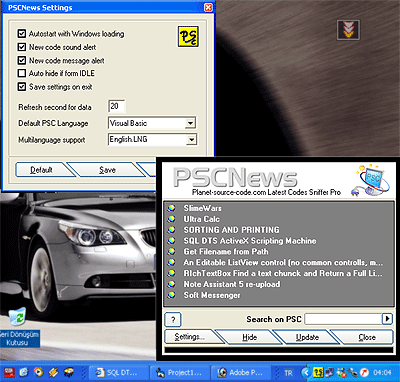



## PSCNews New Code Downloader

### Description

----

MUST SEE 

----

PSCNews Complete Project!

This program supporting Planet Source Code.

How can i know New articles and codes automatical? Bonus!

This program retrieves new codes on if uploaded!

* Easy download method (Learn!)

(How can i use easy and powerfull download module on my project?)

* Convertible project settings (Learn!)

(How can i use settings module on my project?)

* Multi Language Support! (Learn!)

(How can i use different language on my project?)

* TrayBar example and using..

* How can i set my project Windows auto start?)

and easy PSC Search BAR

Examine this excellent project.

Thank you for your votes!

Note: Do yo see my convertible email project on PSC ?

http://www.planet-source-code.com/vb/scripts/ShowCode.asp?txtCodeId=50814&lngWId=1
 
### More Info
 

             |
---                |---
**Submitted On**   |2004-01-07 12:43:00
**By**             |[B\.Cem HANER](https://github.com/Planet-Source-Code/PSCIndex/blob/master/ByAuthor/b-cem-haner.md)
**Level**          |Intermediate
**User Rating**    |5.0 (20 globes from 4 users)
**Compatibility**  |VB 6\.0
**Category**       |[Complete Applications](https://github.com/Planet-Source-Code/PSCIndex/blob/master/ByCategory/complete-applications__1-27.md)
**World**          |[Visual Basic](https://github.com/Planet-Source-Code/PSCIndex/blob/master/ByWorld/visual-basic.md)
**Archive File**   |[PSCNews\_Ne1693441122004\.zip](https://github.com/Planet-Source-Code/b-cem-haner-pscnews-new-code-downloader__1-50953/archive/master.zip)

